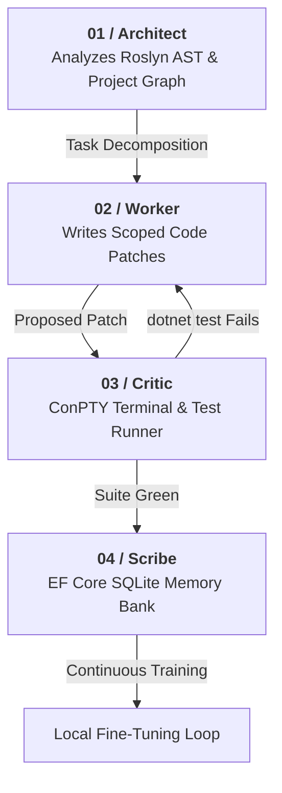

<div align="center">

# ⚡ Coding Sahayi

### Local-First Autonomous AI Coding IDE for Windows

<p align="center">
  <strong>Orchestrates specialized agent swarms over native ConPTY pseudo-terminals, self-repairs failing unit tests autonomously, and continuously fine-tunes on verified project patches.</strong>
</p>

<p align="center">
  <em>Zero cloud subscriptions. Zero code egress. Zero API token bills.</em>
</p>

[](https://codingsahayi.github.io/)
[](https://dotnet.microsoft.com/)
[](https://learn.microsoft.com/windows/apps/winui/winui3/)
[](https://ollama.ai/)
[](LICENSE)

<br />


</div>

---

## 💡 Why Coding Sahayi?

Cloud-hosted AI coding assistants stream entire repositories to external APIs, charge per token, and degrade when compiler or test errors happen. Every failed compile retry becomes paid token churn.

**Coding Sahayi moves the entire loop onto your workstation:**

* **100% Offline & Private:** Inference runs through local endpoints (like `qwen2.5-coder:7b` via Ollama). Code never leaves your machine.
* **ConPTY Process Execution:** Intercepts real compilation and test suite output in background pseudo-terminals via `Pty.Net`.
* **Autonomous Self-Repair:** When tests fail, runtime traces are fed back to the swarm to generate targeted fixes until the suite passes.
* **Gated Diff Review:** Uses DiffPlex for side-by-side diff inspection before any file touches the disk.
* **Continuous Local Fine-Tuning:** Exports verified passing patches to train local models on your actual codebase idioms.

---

## 🔄 The 4-Agent Swarm Architecture

Rather than relying on one monolithic prompt, Coding Sahayi divides responsibilities across four specialized agents:



* **`Architect`**: Analyzes Roslyn AST syntax trees and project dependency graphs to plan atomic tasks before edits begin.


* **`Worker`**: Emits surgical code modifications restricted to the target scope to prevent context drift.


* **`Critic`**: Spawns an interactive ConPTY session, executes commands, parses structured stack traces, and loops until tests pass.


* **`Scribe`**: Serializes verified patches, failing traces, and working solutions into an EF Core SQLite datastore.


---

## 🖥️ Application Showcase

---

## ⚡ Quick Start

### 1. Prerequisites

* **OS:** Windows 10 (Build 19041+) or Windows 11.


* **Runtime:** [.NET 8.0 SDK](https://dotnet.microsoft.com/download/dotnet/8.0).


* **Local Backend:** [Ollama](https://ollama.ai/) installed and running.


### 2. Pull the Default Model

```powershell
ollama run qwen2.5-coder:7b

```

### 3. Clone & Build

```powershell
git clone [https://github.com/codingsahayi/codingsahayi.github.io.git]
cd codingsahayi

# Build using the x64 configuration
dotnet restore
dotnet build CodingSahayi.csproj -c Debug -p:Platform=x64

```

### 4. Launch & Test

Run the binary:

```powershell
.\bin\x64\Debug\net8.0-windows10.0.19041.0\CodingSahayi.exe

```

1. Click **Select Workspace** and pick your project root.
2. Ensure the bottom selector is set to **`Ollama (Local) (Local | P1)`**.
3. Run a prompt:
> *"Run dotnet test, find the failing assertion, and propose a diff to fix it."*


---

## 📊 Technical Comparison

| Feature | Cloud AI Tools | Terminal CLI Agents | Coding Sahayi |
| --- | --- | --- | --- |
| **Hosting** | Cloud APIs | Terminal / Local | **Native Windows Desktop (WinUI 3)**<br> |
| **Token Cost** | $20–$100+/mo | Varies | **$0.00 (Zero Token Bills)**<br> |
| **Code Privacy** | Code sent over wire | Local or Cloud | **100% Local / Offline**<br> |
| **Test Verification** | Manual copy-paste | Headless CLI | **Real ConPTY Pseudo-Terminal**<br> |
| **Safety Gate** | Auto-write or inline | CLI confirmation | **Interactive Side-by-Side Diff Review**<br> |
| **Fine-Tuning** | Not supported | Complex scripts | **In-IDE Continuous Layer Streaming**<br> |

---

## 📂 Project Structure

```text
CodingSahayi/
├── App.xaml / App.xaml.cs            # WinUI 3 Lifecycle & Bootstrap
├── MainWindow.xaml / .cs             # Shell, Layout, and Chat Panels
├── AgentContextManager.cs            # Tool-call Interception & Swarm Loop
├── ToolRegistry.cs                   # Native Action Engine (ConPTY, IO)
├── DiffReviewDialog.xaml / .cs       # DiffPlex Side-by-Side Reviewer
├── Services/
│   ├── ConPtyTerminalService.cs      # Terminal Integration via Pty.Net
│   ├── WorkspaceAnalysisService.cs   # Roslyn AST Codebase Parser
│   └── MemoryBankContext.cs          # EF Core SQLite Local Memory
└── docs/                             # GitHub Pages Documentation & Assets

```

---

## 🤝 Credits & Acknowledgments

* **Continuous Fine-Tuning:** Developed using concepts from the [Soup CLI](https://github.com/MakazhanAlpamys) layer-streaming approach by **Alpamys Makazhan (@MakazhanAlpamys)**.


* **Diff Viewer:** Powered by the open-source [.NET DiffPlex library](https://github.com/mmanela/diffplex).
* **Terminal Engine:** Native Windows pseudo-terminal integration enabled by [Pty.Net](https://www.google.com/search?q=https://github.com/microsoft/pty.net).

---

## 👤 Author

**Muhammed Shabeer**

*Partner & Chief Technology Officer, Spectron Solutions Qatar*

*Enterprise Solutions Architect operating across Doha, Qatar and Mattool (Kerala, India)*

* 🌐 **Portfolio:** [muhammedshabeer.github.io](https://www.google.com/search?q=https://muhammedshabeer.github.io/)

* 🐙 **GitHub:** [@MuhammedShabeer](https://www.google.com/search?q=https://github.com/MuhammedShabeer)

* 💼 **LinkedIn:** [Muhammed Shabeer](https://www.google.com/search?q=https://www.linkedin.com/in/muhammed-shabeer-)

* 📧 **Email:** [muhammedshabeerm@hotmail.com](https://www.google.com/search?q=mailto%3Amuhammedshabeerm%40hotmail.com)


---

## 📄 License

Distributed under the **MIT License**. See `LICENSE` for details.
